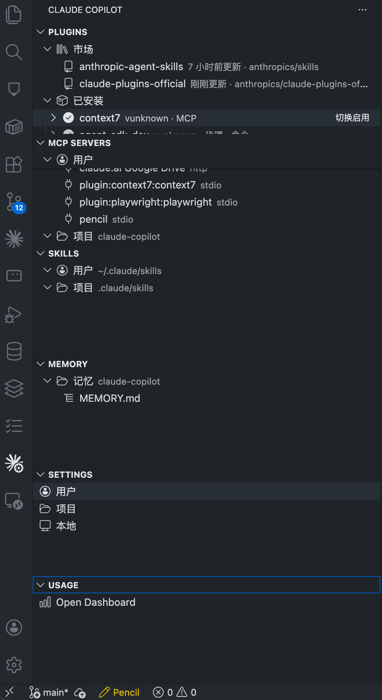
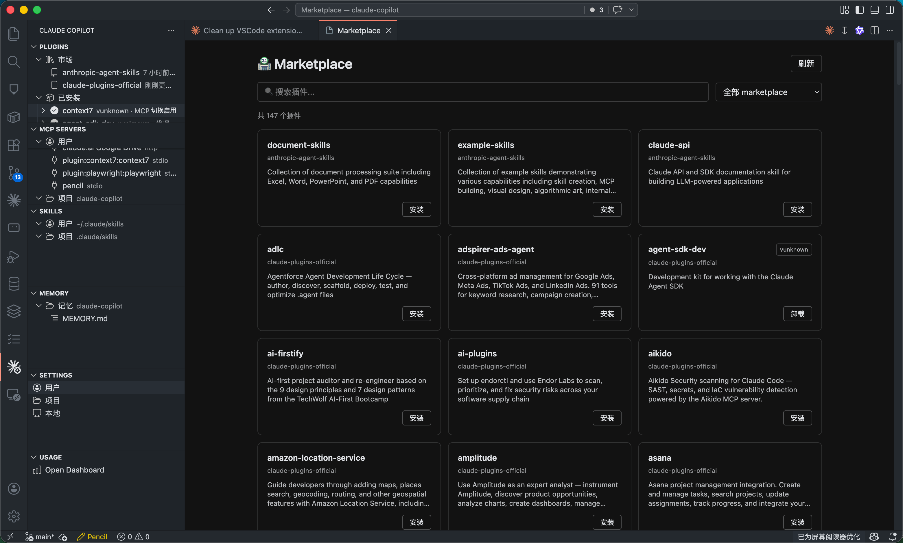
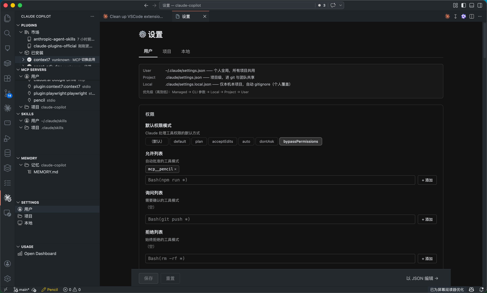
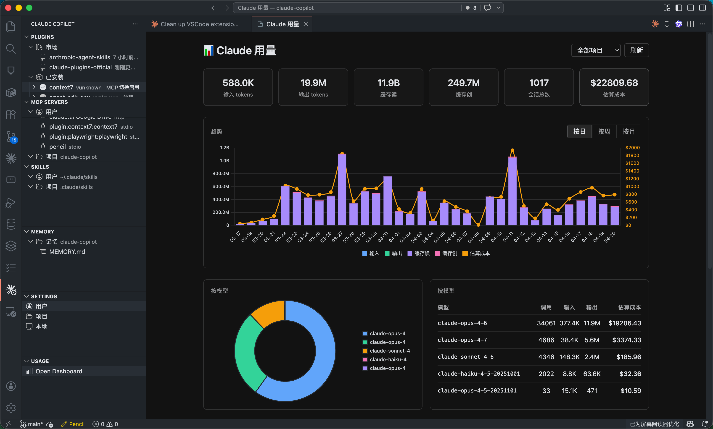

<div align="center">

# Claude Copilot

[](https://github.com/weixiaospace/vscode-claude-copilot/releases)
[](https://code.visualstudio.com/updates/v1_90)
[](LICENSE)

**[English](README.md) | [中文](README.zh-CN.md)**

</div>

VS Code 扩展 —— [Claude Code](https://docs.claude.com/zh-CN/docs/claude-code/overview) 配置可视化管理工具。提供 plugins / MCP / skills / memory / settings / usage 一站式面板，与官方 Claude Code CLI 并存使用。

<div align="center">
  
</div>

---

## 📸 截图

<table>
  <tr>
    <td width="50%" align="center">
      <a href="docs/screenshots/marketplace.png"></a>
      <sub><b>市集</b> —— 浏览、搜索、安装插件</sub>
    </td>
    <td width="50%" align="center">
      <a href="docs/screenshots/settings.png"></a>
      <sub><b>设置</b> —— 可视化编辑，支持 provider / 鉴权方式切换</sub>
    </td>
  </tr>
  <tr>
    <td colspan="2" align="center">
      <a href="docs/screenshots/usage.png"></a>
      <sub><b>Usage 仪表盘</b> —— Chart.js 交互图表，日/周/月切换、按模型环形图、成本折线叠加</sub>
    </td>
  </tr>
</table>

---

## ✨ 功能

| 模块 | 能做什么 |
|---|---|
| 🔌 **插件与市集** | 安装 / 卸载 / 启用 / 禁用插件；添加 / 移除 / **更新** marketplace（单个或全部）。已安装插件**可展开** —— 点进去能看到 skills、agents、commands、hooks、MCP 等具体内容，点子节点直接打开对应文件 |
| 🧩 **MCP 服务器** | 用户级（CLI）和项目级（`.claude/settings.json`）分别管理，两棵独立的树 |
| 🪄 **Skills** | 浏览 `~/.claude/skills` 与 `.claude/skills`。展开秒显示（已缓存）。点击即可编辑 `SKILL.md` |
| 🧠 **Memory** | 浏览 `~/.claude/projects/<slug>/memory` 下的记忆文件，单独列出 MEMORY.md 索引项 |
| ⚙️ **Settings** | User / Project / Local 三层**完全可视化**编辑器。~50 个配置项全部是开关 / toggle / select / tag 列表 —— 包括：provider 切换（Anthropic / Bedrock / Vertex / Foundry），鉴权方式切换（订阅 / API Key / Auth Token / Helper 脚本），权限的 allow/ask/deny/附加目录，15 个功能开关，6 个数值限制，记忆与梦境开关等等。切换 provider / 鉴权模式时旧凭证自动清除 |
| 📊 **Usage 仪表盘** | 解析 session jsonl。**Chart.js** 交互式堆叠柱状图 + 环形图。支持按日 / 周 / 月切换粒度，按项目过滤，按模型拆分。成本估算使用 Anthropic 官方价格（Opus / Sonnet / Haiku 4.x 和 3.5） |

---

## 🚀 快速开始

### 从商店安装（推荐）

在扩展视图（`Cmd+Shift+X` / `Ctrl+Shift+X`）中搜索 **"Claude Copilot"** 并点击安装。

### 手动安装

从 [Releases](https://github.com/weixiaospace/vscode-claude-copilot/releases) 下载最新 `.vsix`：

```bash
code --install-extension claude-copilot-0.1.16.vsix
```

### 使用步骤

1. 安装 [Claude Code CLI](https://docs.claude.com/zh-CN/docs/claude-code/overview)，用 `claude --version` 验证
2. 点击左侧活动栏的 **Claude Copilot** 图标（齿轮）
3. **Plugins** 面板：添加 marketplace → 安装插件；点击已安装插件可查看它的 skills/agents/hooks
4. **Settings** 面板：选层级（用户 / 项目 / 本地）→ 全 UI 配置，不用直接改 JSON
5. **Usage** 面板：看 token 消耗趋势和估算成本

---

## 📋 命令

命令面板（`Cmd+Shift+P` / `Ctrl+Shift+P`）搜 "Claude Copilot"：

| 命令 | 说明 |
|---|---|
| `Claude Copilot: Refresh All` | 刷新所有树形视图 |
| `Claude Copilot: Open Settings Panel` | 打开可视化设置编辑器 |
| `Claude Copilot: Open Usage Dashboard` | 打开 token 用量分析 |
| `Claude Copilot: Browse Marketplace` | 浏览可用插件 |
| `Install Plugin... / Update / Update All / Add Marketplace...` | 市集操作（通过树的 hover 按钮或右键菜单） |
| `Create Skill... / Delete Skill` | 管理技能 |
| `New Memory... / Delete Memory` | 管理记忆文件 |
| `Add User MCP... / Add Project MCP... / Remove MCP Server` | 管理 MCP 服务器 |

---

## 🛠 开发

```bash
pnpm install       # 安装 root + webview-ui 依赖
pnpm build         # esbuild 扩展 + vite webview 打包
pnpm test          # 35 个 mocha 核心层单测
pnpm package       # vsce 打包 → claude-copilot-<版本>.vsix
```

VS Code 里按 F5 启动 Extension Development Host。

### 目录结构

- `src/core/` —— 纯逻辑，零 vscode 依赖，单测全覆盖
- `src/tree/` —— TreeDataProvider 实现（6 个面板）
- `src/commands/` —— VS Code 命令注册
- `src/webview/` —— WebView panel host（settings / marketplace / usage）
- `webview-ui/` —— Vite 打包的 vanilla TS + Tailwind 4 UI，3 个入口
- `l10n/` —— 中英文双语 bundle
- `resources/` —— 活动栏图标 + 市集图标

更多架构细节见 [CLAUDE.md](CLAUDE.md)。

---

## 📝 前置依赖

- VS Code `^1.90.0`
- 本机已安装 [Claude Code CLI](https://docs.claude.com/zh-CN/docs/claude-code/overview)

---

## 🤝 参与贡献

欢迎提 Issue 和 PR：[GitHub Issues](https://github.com/weixiaospace/vscode-claude-copilot/issues)

---

## 📄 许可证

[MIT](LICENSE)
